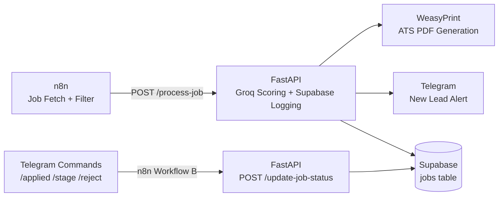
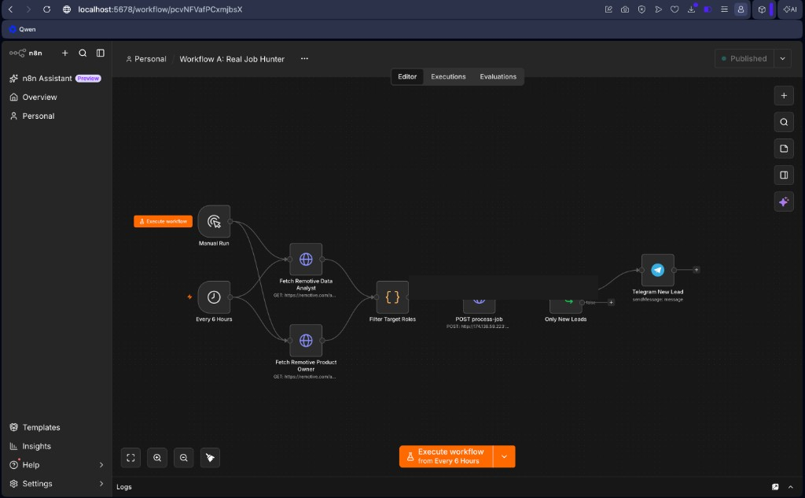
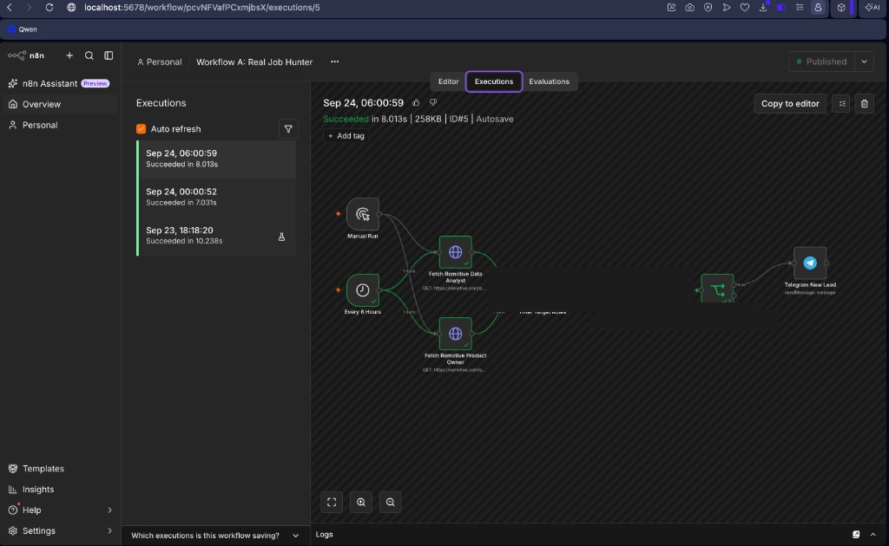
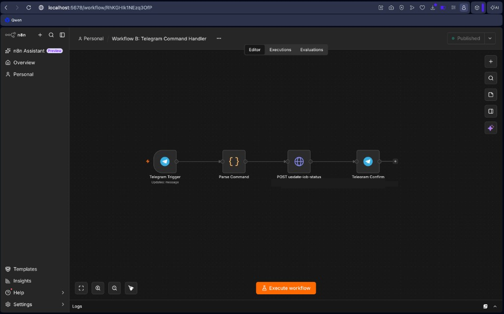
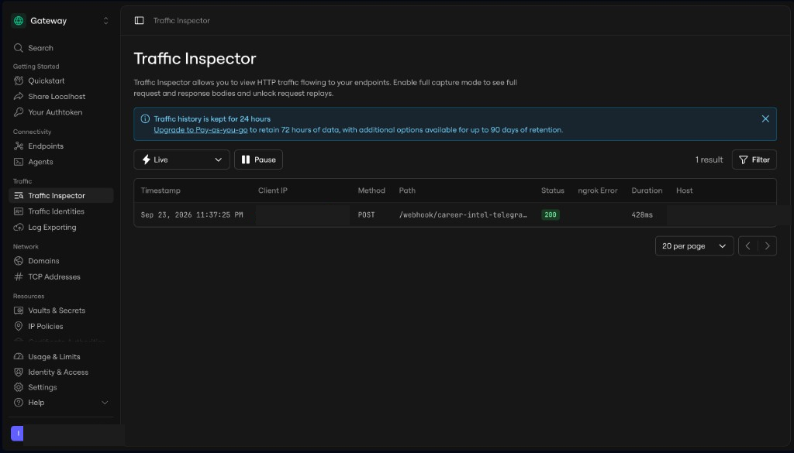
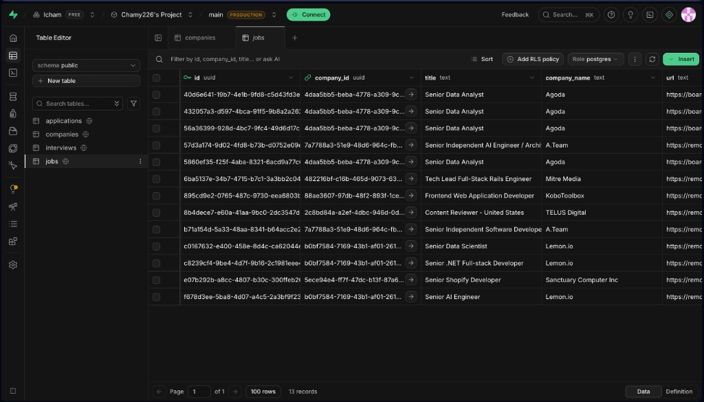

# Career Intel Engine

### Autonomous AI Job Hunter & ATS Resume Tailor

[](https://www.python.org/)
[](https://fastapi.tiangolo.com/)
[](https://supabase.com/)
[](https://groq.com/)
[](https://n8n.io/)
[](https://weasyprint.org/)
[](LICENSE)

Scores remote roles with an LLM, generates ATS-optimized PDF resumes tailored by career archetype, and tracks every application from Telegram — so Data, Product, and AI Automation candidates spend time interviewing, not copy-pasting.

---

## Elevator pitch

Career Intel Engine is an end-to-end automation stack that finds relevant jobs, scores fit with Groq, logs leads in Supabase, and ships a tailored ATS PDF plus a Telegram alert with a human-friendly `job_number`. Reply with `/applied42` (or stage/reject) and the pipeline updates status without opening a spreadsheet.

---

## Architecture



| Layer | Role |
|-------|------|
| **n8n Workflow A** | Schedule + Remotive fetch → filter → call FastAPI |
| **FastAPI** | Dedup, Groq score, archetype CV, persist, notify |
| **WeasyPrint** | Render ATS-friendly HTML → PDF |
| **Supabase** | Source of truth for jobs / applications |
| **n8n Workflow B** | Telegram commands → status updates |

### Visuals

<p align="center">
  
</p>
<p align="center"><em>Workflow A — scheduled Remotive fetch → FastAPI scoring → Telegram alert</em></p>

<p align="center">
  
</p>
<p align="center"><em>Production-style execution history (succeeded runs every 6 hours)</em></p>

<p align="center">
  
</p>
<p align="center"><em>Workflow B — Telegram commands → status update API → confirmation</em></p>

<p align="center">
  
</p>
<p align="center"><em>Telegram webhook traffic verified (HTTP 200 via tunnel)</em></p>

<p align="center">
  
</p>
<p align="center"><em>Supabase `jobs` table — structured logging for every scored lead</em></p>

---

## Tech stack

- **Python / FastAPI / Uvicorn** — API orchestration and typed request/response models  
- **Groq** — low-latency LLM scoring + CV rewrite  
- **Supabase (Postgres)** — durable job store with `job_number` tracking  
- **WeasyPrint + Jinja2** — ATS-oriented PDF generation  
- **n8n** — scheduling, Remotive HTTP fetch, Telegram bot UX  
- **httpx / python-dotenv** — outbound calls and secret loading via env vars  

---

## Key features

- **`job_number` tracking** — short integer IDs in Telegram (`/applied42`) instead of UUIDs  
- **Duplicate prevention** — URL-based dedup so re-fetches do not spam or regenerate PDFs  
- **Archetype-based CV tailoring** — Data / Product / AI prompt templates drive summary tone and bullets  
- **Score bands** — LLM fit score persisted with each lead for prioritization  
- **Telegram ops loop** — new-lead alerts + command-driven status updates (`Applied`, `Tech Interview`, `Rejected`)  
- **API key protection** — `x-api-key` on mutating endpoints (`secrets.compare_digest`)  
- **Importable n8n workflows** — ready JSON under `n8n-workflows/` (placeholders only; no live secrets)

---

## Local setup

### Prerequisites

- Python 3.11+  
- [Supabase](https://supabase.com/) project (run `schema.sql`)  
- [Groq](https://console.groq.com/) API key  
- Optional: Telegram bot token + chat ID, n8n, WeasyPrint system libs  

**macOS WeasyPrint deps:**

```bash
brew install pango cairo gdk-pixbuf libffi
```

### 1. Clone

```bash
git clone https://github.com/Chamy226/career-intel-engine.git
cd career-intel-engine
```

### 2. Create a virtualenv and install deps

```bash
python3 -m venv venv
source venv/bin/activate
pip install -r requirements.txt
```

### 3. Configure environment

Copy the template and fill in **your** values (never commit `.env`):

```bash
cp .env.example .env
```

Required variables (see `.env.example`):

| Variable | Purpose |
|----------|---------|
| `SUPABASE_URL` / `SUPABASE_KEY` | Postgres API access |
| `GROQ_API_KEY` | LLM scoring + rewrite |
| `API_KEY` | Protects `/update-job-status` via `x-api-key` |
| `CANDIDATE_*` | Header fields on generated CVs |
| `TELEGRAM_BOT_TOKEN` / `TELEGRAM_CHAT_ID` | Optional alerts |

Apply the schema in the Supabase SQL editor:

```bash
# paste and run schema.sql in Supabase → SQL Editor
```

### 4. Run the API

```bash
uvicorn main:app --host 0.0.0.0 --port 8000 --reload
```

Health check:

```bash
curl -sS http://127.0.0.1:8000/health
```

### 5. Smoke-test job processing

```bash
curl -sS -X POST http://127.0.0.1:8000/process-job \
  -H 'Content-Type: application/json' \
  -d '{
    "title": "Senior Data Analyst",
    "company_name": "Example Corp",
    "url": "https://example.com/jobs/demo-1",
    "description": "SQL, Python, dashboards, stakeholder communication.",
    "archetype": "Data",
    "ats_system": "Unknown"
  }'
```

### 6. (Optional) n8n + Telegram

1. Import `n8n-workflows/workflow-a-real-job-hunter.json` and `workflow-b-telegram-command-handler.json`.  
2. Replace `YOUR_FASTAPI_HOST`, `YOUR_API_KEY`, and `YOUR_TELEGRAM_CHAT_ID` in the HTTP / Telegram nodes.  
3. Attach Telegram credentials in n8n (never hardcode bot tokens in JSON).  
4. Expose Workflow B’s webhook with a tunnel (ngrok / Cloudflare) and activate the workflow.

VPS Docker notes live in [`deploy/n8n/README.md`](deploy/n8n/README.md).

---

## API surface

| Method | Path | Auth | Description |
|--------|------|------|-------------|
| `GET` | `/health` | — | Liveness + config flags |
| `POST` | `/process-job` | — | Score, dedup, PDF, log, Telegram |
| `POST` | `/update-job-status` | `x-api-key` | Update by `job_number` |

---

## Security notes

- Secrets live in `.env` only (gitignored). Use `.env.example` as the public template.  
- Workflow JSON and deploy scripts ship with **placeholders** — swap in local credentials after import.  
- Rotate any key that was ever pasted into chat, screenshots, or old workflow exports.  
- Prefer Cloudflare Tunnel (or similar) over long-lived public IP exposure for n8n webhooks.

---

## Project layout

```text
career-intel-engine/
├── main.py                 # FastAPI app (scoring, PDF, Telegram, status)
├── schema.sql              # Supabase tables / job_number
├── requirements.txt
├── .env.example            # Public template (no real secrets)
├── n8n-workflows/          # Importable Workflow A + B
├── deploy/n8n/             # Docker Compose pack for VPS n8n
├── docs/assets/            # README screenshots (IPs / PII redacted)
└── output/                 # Generated PDFs (gitignored)
```

---

## Skills this project demonstrates

- **AI product / automation** — LLM scoring pipelines with human-in-the-loop Telegram UX  
- **Data / backend** — Postgres schema design, idempotent ingest, typed APIs  
- **DevOps** — env-based secrets, n8n orchestration, tunnel-backed webhooks  
- **Document generation** — ATS-aware PDF rendering for recruiting workflows  

---

## License

MIT — use freely for learning and portfolio work. Replace candidate profile fields before sharing generated PDFs.
